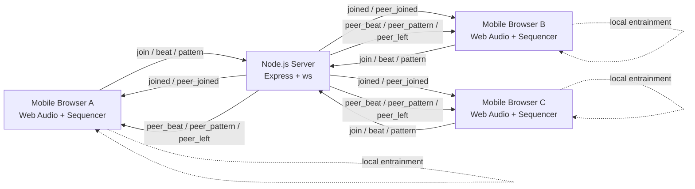

# MobMusEntrain

Multi-device mobile musical entrainment app where phones in the same room synchronize to a shared pulse.

MobMusEntrain runs in the browser with the Web Audio API and exchanges beat events over WebSockets. Each device plays its own pattern and gradually aligns timing and tempo using a Kuramoto-inspired coupling approach.

## Features

- Real-time room-based sync over WebSockets
- Mobile-first UI with 16-step sequencer
- Built-in rhythm presets: Pulse, Groove, Techno, Clave
- Web Audio synthesis (kick, hat, snare, tone)
- Peer-aware phase visualization
- Automatic tempo and phase convergence using lightweight entrainment logic
- Shareable room links

## Tech Stack

- Backend: Node.js, Express, ws
- Frontend: Vanilla JavaScript, HTML, CSS
- Audio: Web Audio API

## Project Structure

```text
.
├── server.js            # Express server + WebSocket room broker
├── package.json         # Scripts and dependencies
├── README.md
└── public/
    ├── index.html       # UI shell
    ├── style.css        # Mobile-first styles
    └── app.js           # Audio engine, scheduler, sequencer, sync logic
```

## How It Works

### 1) Room Join and Peer Discovery

When a client joins a room:

- The server sanitizes room IDs to lowercase alphanumeric (max 12 chars)
- The client is added to an in-memory room map
- Existing peer IDs are returned to the new client
- Other peers are notified with a `peer_joined` event

Rooms are ephemeral and live only in server memory.

### 2) Beat Broadcast

While running, each client broadcasts downbeat events with:

- wall-clock beat timestamp
- local BPM
- beat counter

Peers receive these events and feed them into local entrainment correction.

### 3) Entrainment (Kuramoto-Inspired)

Each device continuously schedules audio in a look-ahead loop. On incoming peer beats, it applies two small corrections:

- phase correction: adjust next scheduled step time toward peer phase
- tempo correction: nudge BPM toward peer tempo (or harmonic relation)

Conservative coupling constants keep adaptation smooth and musical, rather than snapping abruptly.

## WebSocket Message Protocol

### Client -> Server

- `join`
	- payload: `{ type: "join", room, deviceId }`
- `beat`
	- payload: `{ type: "beat", timestamp, bpm, beatCount }`
- `pattern`
	- payload: `{ type: "pattern", patternIndex }`
- `ping`
	- payload: `{ type: "ping", timestamp }`

### Server -> Client

- `joined`
	- payload: `{ type: "joined", roomId, deviceId, peerIds, peerCount }`
- `peer_joined`
	- payload: `{ type: "peer_joined", deviceId, peerCount }`
- `peer_beat`
	- payload: `{ type: "peer_beat", deviceId, timestamp, bpm, beatCount }`
- `peer_pattern`
	- payload: `{ type: "peer_pattern", deviceId, patternIndex }`
- `peer_left`
	- payload: `{ type: "peer_left", deviceId, peerCount }`
- `pong`
	- payload: `{ type: "pong", timestamp }`

## Getting Started

### Prerequisites

- Node.js 18+ recommended
- npm

### Install

```bash
npm install
```

### Run (production mode)

```bash
npm start
```

App will be available at:

```text
http://localhost:3000
```

### Run (development mode)

```bash
npm run dev
```

This starts the server with `nodemon` for auto-reload.

## Usage

1. Open the app on one phone or browser.
2. Enter a room code and press JOIN.
3. Open the same URL on other devices and join the same room code.
4. Press START on each device.
5. Choose or edit patterns in the sequencer and listen as devices converge.

Tip: Use the generated share link after joining to quickly onboard other devices.

## Architecture Diagram



Notes:

- The server is a relay/broker and does not generate audio.
- Each client keeps its own scheduler and synthesis engine.
- Convergence happens on-device from incoming peer beat events.

## Deployment Notes

- The app uses WebSockets, so your host/proxy must support WebSocket upgrade requests.
- For remote access, serve over HTTPS for best mobile compatibility.
- State is in-memory only. Restarting the server clears rooms and peers.

## Troubleshooting

### No sound after pressing START

- Ensure you interacted with the page (tap/click) before starting; browsers block autoplay audio.
- Check that the phone is not in silent mode and media volume is up.
- Try reloading once and pressing START again.

### Device shows Offline / cannot join

- Verify the server is running and reachable at the correct URL/port.
- Confirm all devices are on networks that can reach the host.
- If using a reverse proxy, confirm WebSocket upgrades are enabled.

### Peers not appearing in the room

- Ensure everyone uses the exact same room code.
- Room IDs are sanitized to lowercase alphanumeric and max 12 chars.
- Reload devices that connected before a network change.

### Sync feels unstable or drifts

- High latency and jitter reduce entrainment quality; prefer a stable Wi-Fi network.
- Let the system run for several bars so phase/tempo coupling can settle.
- Keep device CPU usage low (close heavy background apps/tabs).

### Mobile performance is choppy

- Use recent versions of Safari/Chrome.
- Avoid low-power mode when possible.
- Reduce the number of active devices in one room if timing becomes inconsistent.

## Limitations

- No persistent storage for rooms or patterns
- No authentication or access control
- Synchronization quality depends on network latency/jitter
- Browser autoplay policies require a user interaction before audio starts

## Future Roadmap

1. Persistent rooms and optional saved patterns.
2. Authentication and private/invite-only rooms.
3. Latency compensation improvements (clock offset estimation and smoothing).
4. Shared transport controls (host start/stop, synchronized preset switching).
5. Recording/export options for collaborative sessions.
6. More instrument voices and user-editable synthesis parameters.
7. Optional metrics/debug panel for phase error and network timing.

## Scripts

- `npm start` - start server
- `npm run dev` - start server with nodemon

## License

MIT