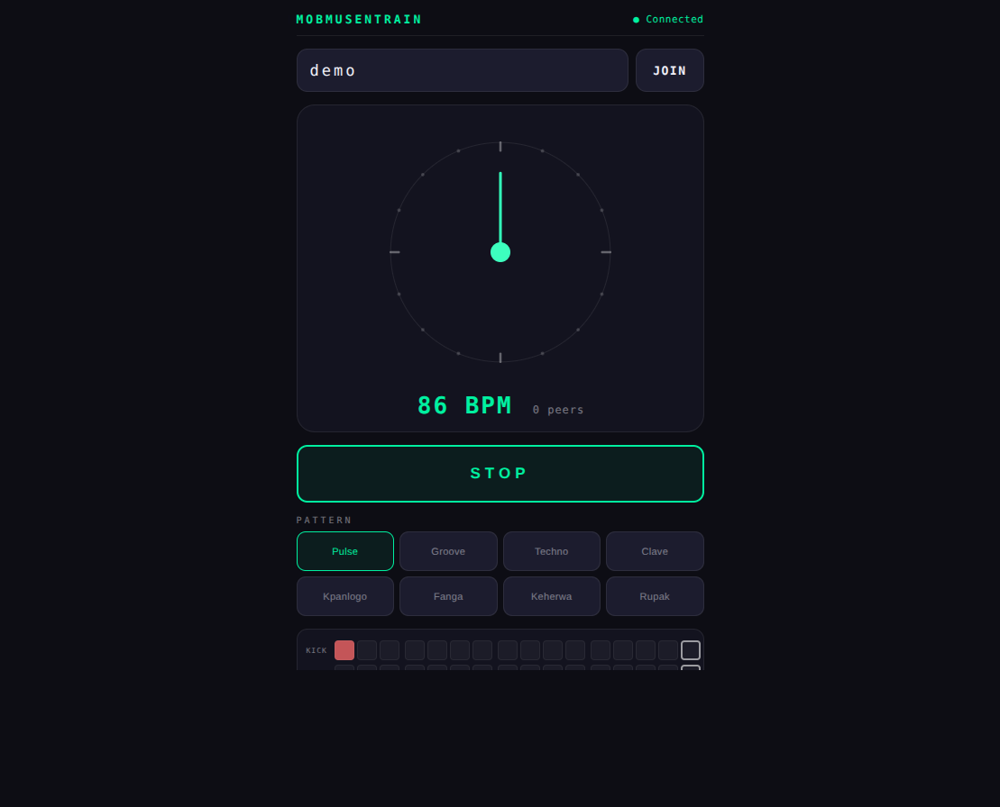

# MobMusEntrain

Mobile browser app for collaborative rhythmic entrainment across multiple devices.



## What This Is

- One Node.js server for rooms and message relay
- Multiple phones/browsers join the same room code
- Each device plays audio locally and synchronizes via shared beat messages

## Quick Start

```bash
npm install
npm start
```

Open `http://localhost:3000`, join a room, and press START.

## Deploy

Use Render (recommended). This repository includes `render.yaml`.

Detailed deployment steps are in the wiki.

## Documentation Wiki

All detailed docs are on the GitHub Wiki: https://github.com/alexarje/mobmusentrain/wiki

## Scripts

- `npm start`
- `npm run dev`

## License

MIT
